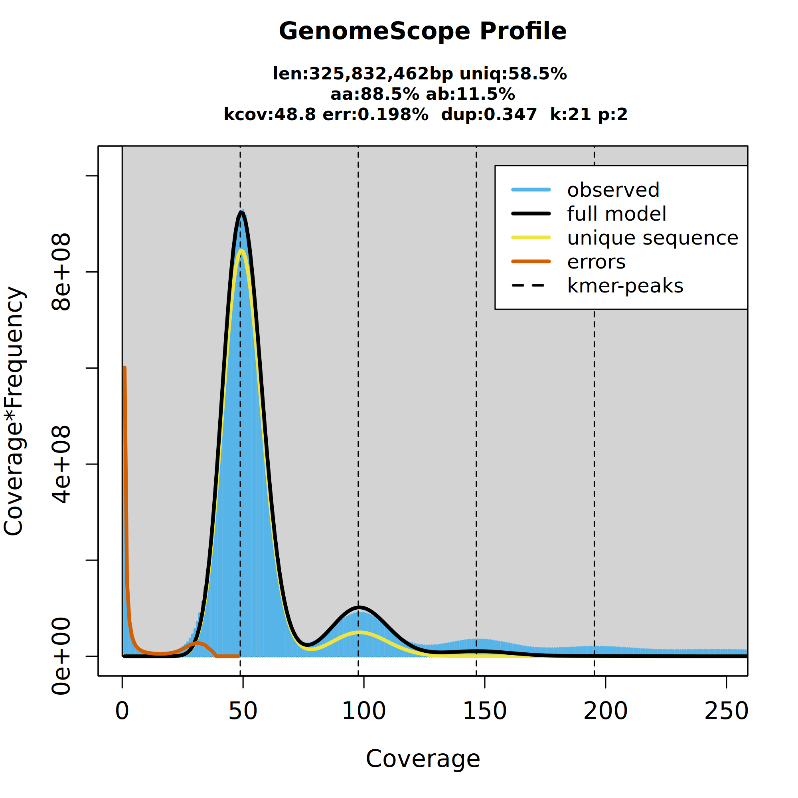
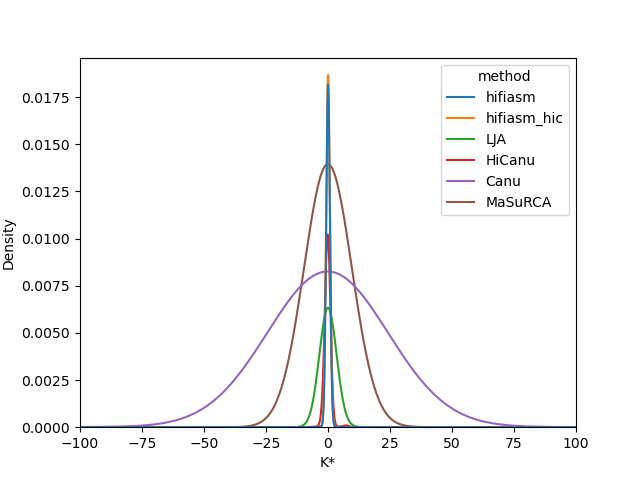

# Assembly olympics

This is a small snakemake workflow that allows you to quickly gather basic genome assembly statistics so that you can compare methods.
Summary statistics include N50s, scaffold/contig #s, BUSCO completeness, as well as [K* statistics](https://github.com/arangrhie/merfin).

This is intended for a single genome as it relies on a single BUSCO lineage to function.

Most dependencies are handled via conda in this workflow.

If you need support getting snakemake to run, I'd suggest [the docs](https://snakemake.readthedocs.io/en/stable/)!

## Usage

This was designed on a SLURM cluster with some unique partitioning rules.
You might need to tweak the `resources` options in some of the `Snakefile` rules!

To run this workflow, edit `config/config.yaml` to point to your `hifi_reads` file (or illumina, I haven't seen much difference!).
These reads are used to create the genomescope2 plot and are used to create the merfin histogram and completeness scores.
Also supply an `assemblies.csv` file under config - this should contain two columns, `assembly` which will be used as the name of that assembly (no special chars!) and `path` which is just the path to that assembly.
Also supply a `busco_lineage`, this is passed onto a rule which downloads that lineage and uses it for all later analysis.
Multiple lineages are not supported.

## Output

There are three primary outputs of this pipeline:

### Genomescope2 profile

This is just the plot from genomescope2.
Just realised as I'm typing this that I never made a connection between the genomescope2 kcov value, and it's later use in merfin...
You'll have to run this twice, once to get the plot and the kcov value, and then again but edit the `-peak` value in the merfin rule to this.
Might fix this in future!

### Merfin histograms

*Looking good hifiasm!*

These are the KDE density histograms from merfin.
I've restricted the output plot x axis to (-100,100) for better vis - you might want to change this.

### Summary table

This pipeline also produces a summary table `.csv`:

| Completeness | # Scaffolds | Scaffold N50 | # Contigs | Contig N50 | Total Length | BUSCO Complete | assembly
| --- | --- | --- | --- | --- | --- | --- | --- |
| 0.93825 | 1667 | 46.3 MB | 1667 | 46.3 MB | 753.3 MB | 98.5 | hifiasm |
| 0.93548 | 1666 | 46.3 MB | 1666 | 46.3 MB | 751.2 MB | 98.5 | hifiasm_hic |
| 0.88635 | 991 | 22.1 MB | 991 | 22.1 MB | 713.2 MB | 98.5 | LJA |
| 0.9037 | 4043 | 18.8 MB | 4043 | 18.8 MB | 803.0 MB | 98.5 | HiCanu |
| 0.71632 | 1490 | 2.8 MB | 1490 | 2.8 MB | 728.3 MB | 94.2 | Canu |
| 0.82445 | 1591 | 2.4 MB | 1628 | 2.2 MB | 679.9 MB | 98.5 | MaSuRCA |

It'll look something like this.

